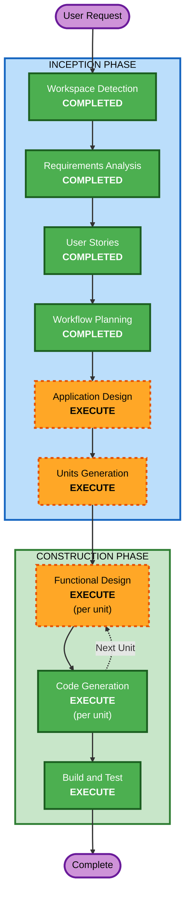

# Execution Plan — Smart Agentic Calendar MCP Server

## Detailed Analysis Summary

### Change Impact Assessment
- **User-facing changes**: Yes — 15+ MCP tools as the AI agent's primary interface
- **Structural changes**: Yes — entirely new multi-layer architecture (storage, scheduling engine, MCP server)
- **Data model changes**: Yes — new SQLite schema for tasks, events, schedules, recurrence, configuration, analytics
- **API changes**: Yes — full MCP tool suite (CRUD, scheduling, analytics, configuration)
- **NFR impact**: Yes — performance (<500ms replan), reliability (ACID), async background replan pattern

### Risk Assessment
- **Risk Level**: Medium — complex scheduling algorithm, but well-scoped single-user local system
- **Rollback Complexity**: Easy — greenfield, no existing system to break
- **Testing Complexity**: Complex — constraint satisfaction edge cases, recurrence patterns, background replan timing

## Workflow Visualization



### Text Alternative

```
Phase 1: INCEPTION
  - Workspace Detection      (COMPLETED)
  - Requirements Analysis     (COMPLETED)
  - User Stories              (COMPLETED)
  - Workflow Planning         (COMPLETED)
  - Application Design        (EXECUTE)
  - Units Generation          (EXECUTE)

Phase 2: CONSTRUCTION (per unit)
  - Functional Design         (EXECUTE, per unit)
  - NFR Requirements          (SKIP)
  - NFR Design                (SKIP)
  - Infrastructure Design     (SKIP)
  - Code Generation           (EXECUTE, per unit)
  - Build and Test            (EXECUTE)

Phase 3: OPERATIONS
  - Operations                (PLACEHOLDER)
```

## Phases to Execute

### INCEPTION PHASE
- [x] Workspace Detection (COMPLETED)
- [x] Requirements Analysis (COMPLETED)
- [x] User Stories (COMPLETED)
- [x] Workflow Planning (IN PROGRESS)
- [ ] Application Design - **EXECUTE**
  - **Rationale**: New multi-layer system requires component identification, service layer design, and dependency mapping. Components include: storage layer, scheduling engine (constraint solver), replan coordinator (background async), MCP server layer, analytics engine, recurrence manager.
- [ ] Units Generation - **EXECUTE**
  - **Rationale**: System has multiple distinct domains (task/event management, scheduling, recurrence, analytics, configuration) that benefit from structured decomposition into implementation units with clear boundaries and dependencies.

### CONSTRUCTION PHASE (per unit)
- [ ] Functional Design - **EXECUTE** (per unit)
  - **Rationale**: Complex business logic requires detailed design: constraint satisfaction algorithm, recurrence instance generation, dependency graph validation, conflict detection, background replan coordination, analytics aggregation.
- [ ] NFR Requirements - **SKIP**
  - **Rationale**: NFRs are already well-defined in requirements.md (NFR-1 through NFR-5). No additional assessment needed — performance targets, reliability guarantees, and data integrity requirements are clear.
- [ ] NFR Design - **SKIP**
  - **Rationale**: No complex NFR patterns needed beyond inherent tech choices. SQLite provides ACID. TypeScript strict mode provides type safety. Background replan is a functional design concern, not an NFR pattern.
- [ ] Infrastructure Design - **SKIP**
  - **Rationale**: Local-first architecture with no cloud infrastructure. Single SQLite file, stdio transport, single Node.js process. No deployment architecture, networking, or cloud resource mapping needed.
- [ ] Code Generation - **EXECUTE** (always, per unit)
  - **Rationale**: Implementation planning and code generation for each unit.
- [ ] Build and Test - **EXECUTE** (always)
  - **Rationale**: Build instructions, unit tests, integration tests, and PBT for scheduling functions.

### OPERATIONS PHASE
- [ ] Operations - **PLACEHOLDER**
  - **Rationale**: Future deployment and monitoring workflows. Not applicable for local-first personal tool.

## Success Criteria
- **Primary Goal**: Working MCP server that AI agents can use to manage a smart calendar with auto-replanning
- **Key Deliverables**:
  - TypeScript MCP server with stdio transport
  - SQLite-backed storage layer
  - Constraint satisfaction scheduling engine
  - Background replan with non-blocking reads
  - Full RRULE recurrence support
  - Analytics tools (completion rates, schedule health, estimation accuracy, time allocation)
  - Comprehensive test suite with PBT for scheduling pure functions
- **Quality Gates**:
  - All MCP tools return structured JSON with consistent error formats
  - Scheduler produces valid schedules (no overlaps, respects hard constraints)
  - Replan < 500ms for 200 active tasks
  - PBT properties pass for scheduling math and serialization round-trips
